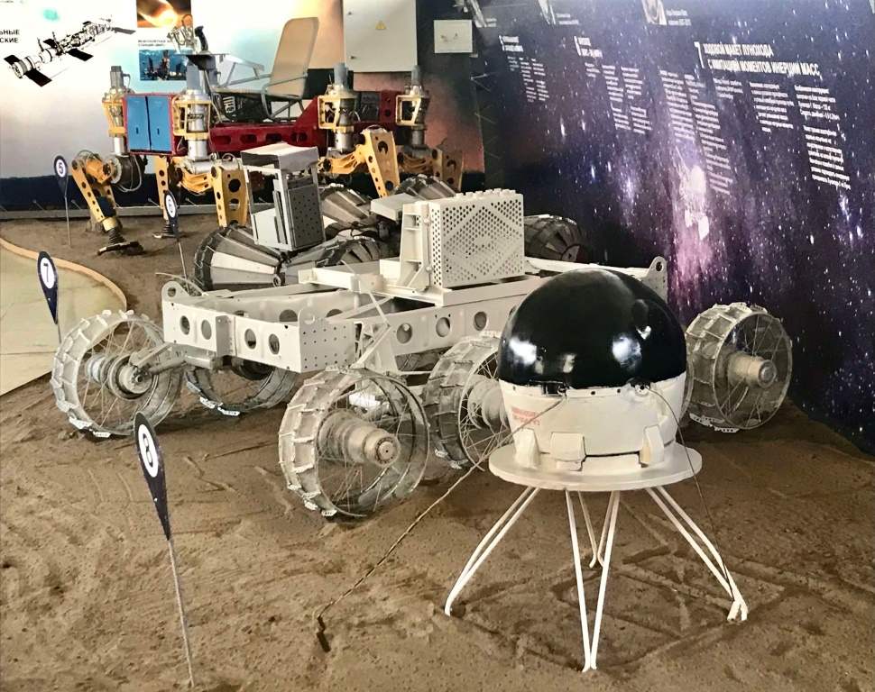
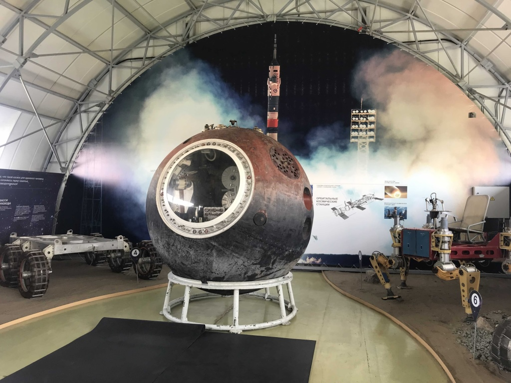
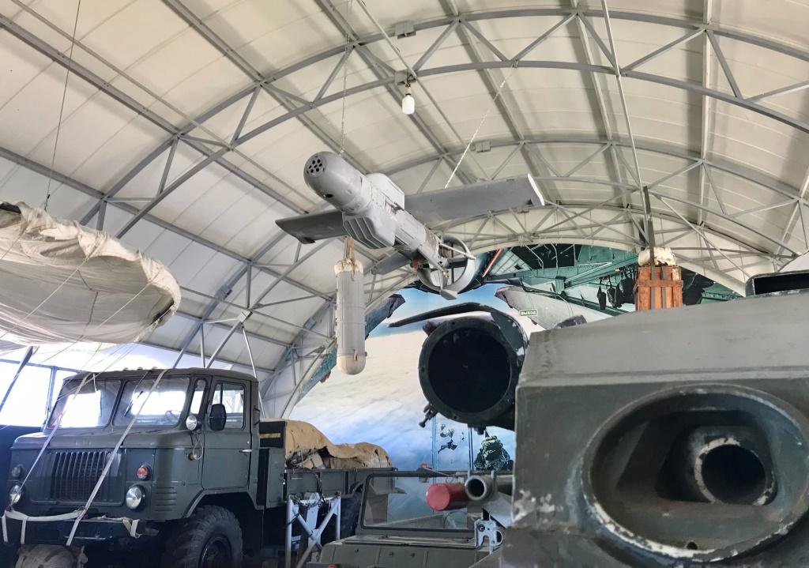

<!DOCTYPE html>
<html lang="en">
<head>
<meta charset="UTF-8" />
<meta name="viewport" content="width=device-width, initial-scale=1.0" />
<title>Парковый комплекс истории техники К. Г. Сахарова</title>
<link rel="stylesheet" href="css/style2.css" />
<link rel="stylesheet" href="css/media.css" />
</head>
<body>
<!-- Главное -->
  <header class="header">
    

      

        
      <h1 class="header_title">Парковый комплекс истории техники К. Г. Сахарова</h1>
      

      <button class="button-bilet" onclick="location.href='https://vmuzey.com/museum/parkovyy-kompleks-istorii-tehniki-im-k-g-saharova'">Перейти на сайт покупки билета</button>
    

  </header>
<main>
  

    <nav class="navigation">
      <ul>
        <!-- Выставки — раскрывающееся меню -->
        <li>
          

            
Выставки

            

              <a href="#Истории-техники" class="nav-link">Истории техники</a>
              <a href="#экспериментальные-автомобили" class="nav-link">Экспериментальные автомобили</a>
              <a href="#паровозное-депо" class="nav-link">Паровозное депо</a>
              <a href="#блокада-ленинграда" class="nav-link">Блокада Ленинграда</a>
              <!-- Вложенное меню "Космический десант" -->
              

                
Космический десант

                

                  <a href="#космос" class="nav-link">Космос</a>
                  <a href="#десантная-техника" class="nav-link">Десантная техника</a>
                  <a href="#афган" class="nav-link">Афган</a>
                

              

            

          

        </li>
        <!-- Простые ссылки с переходом по якорю -->
        <li><a href="#Экскурсия" class="nav-link Excursion-button">Экскурсия</a></li>
        <li><a href="#Туроператор" class="nav-link Tour_Operator-button">Туроператор</a></li>
      </ul>
    </nav>
    

</main>

<!-- Выставки -->
<section id="Истории-техники">
  

    <h2 class="block_title">
ЭКСКУРСИОННОЕ ОБСЛУЖИВАНИЕ ВЫСТАВКИ «ИСТОРИЯ ТЕХНИКИ»
</h2>
    

Выставка «История техники» – самая большая экспозиция Паркового комплекса. Здесь представлены: авиация, бронетехника, артиллерия, РЛС, зенитные орудия, подводная лодка Б-307, морское вооружение, инженерная техника, ЗРК С-300.

    

  
  
  
  
  
  
  

  

</section>
<link rel="icon" type="image2/png" sizes="16x16" href="/favicon-16x16.png">
<!-- Космический десант -->
<section id="космос">
  <h2 class="block_title2">
Выставка «Космический десант»
</h2>
  

"Сезон работы: май-октябрь, ежедневно."

  

"Стоимость единого входного билета – 100 руб. (дополнительно к входному билету на Центральную площадку)."

  

"В одном павильоне собраны три выставки - Космос, Десантная техника, Афган"

  

  

  

"Космос: планетоходы ВНИИ Трансмаш (марсоход, подвижный аппарат исследования Фобоса, шасси луноходов, шагающий аппарат и т.д.), рулевая камера, спускаемый аппарат Ресурс-Ф;"

  

  
  

  

"Десантная техника: БМД-1, амфибия ЛуАЗ-967, 122-мм гаубица Д-30, автомобиль ГАЗ-66, 57-мм самодвижущаяся пушка СД-57, зенитная установка ЗУ-23-2;"

    

  

  

"Афган – посвящается воинам, отдавшим свой интернациональный долг в Афганской войне 1979-1989 годов, представлены элементы обмундирования и вооружения, панорама."

</section>

<!-- Экспериментальные автомобили -->
<section id="экспериментальные-автомобили">
  <h2 class="block_xpCar">
Выставка «Экспериментальные автомобили»
</h2>
  

  
  
  

  

    "На выставке автомобили ВАЗ, не пошедшие в серию, прототипы, макеты, спортивные авто. Представлены макет X-Ray и конкурсной Калины, амфибия Река, гольф-кар, Консул, Ока-2, Силуэт, электромобиль Пони и другие. Сезон работы: май-октябрь, ежедневно. Стоимость единого входного билета – 100 руб. (дополнительно к входному билету на Центральную площадку)."
  

</section>

<!-- Паровозное депо -->
<section id="паровозное-депо">
  <h2 class="bSteam_Locomotive_Depo">
Паровозное депо
</h2>
  

  
  
  
  

    

Представлены паровозы советского и иностранного производства, тепловоз, БЖРК «Молодец», железнодорожный снегоуборочник, ПВО, реактивная артиллерия, сельскохозяйственная техника, специальные автомобили.

  

Сезон работы – круглогодично, ежедневно.

  

Стоимость входного билета:  взрослый - 100 руб.; детский - 50 руб.

</section>

<!-- Блокада Ленинграда -->
<section id="блокада-ленинграда">
  <h2 class="The_Siege_of_Leningrad">
Блокада Ленинграда
</h2>
  

  
  
  
  

  

В здании Депо расположена выставка о Блокадном Ленинграде (дополнительного билета не требуется). Экспозиция рассказывает о жизни в тылу во время Великой Отечественной войны. Выставка состоит из «комнат»: бомбоубежище, борьба с холодом, эвакуация музеев, детский сад, подселение, школьный класс и др.

  

Сезон работы – круглогодично, ежедневно.

  

Стоимость входного билета:  взрослый - 100 руб.; детский - 50 руб.

</section>

<section id="Самая-главная-достопримечательность">
 <h2 class="Submarine">
Подводная лодка Б-307
</h2>
 

  
 

   

Самая главная достопримечательность нашего музея - это подводная лодка Б-307 «Сом». Она находится на Центральной площадке нашего музея

  

сезонно – май-сентябрь

  

билеты приобретаются в кассе Центральной проходной, рекомендуется предварительная запись

 

  Условия посещения можно узнать
  <a href="https://vk.com/tehmuseum?w=wall-34314015_11805" class="hyperlink">здесь
</a>

</section>

<!-- Экскурсия -->
<section id="Экскурсия">
  

    <h2 class="Excursion_Title">
Обзорная экскурсия
</h2>
    

  

    
Групповая обзорная экскурсия по выставке «История техники» проводится группам от 15 человек по предварительной заявке, согласованной с администратором на транспорте заказчика (экскурсионный автобус). Продолжительность – 30 мин. Требование к экскурсионному автобусу – наличие места для экскурсовода. Желательно наличие работающей аудиосистемы с микрофоном.

    
Сезон работы – круглогодично, ежедневно.

    
Стоимость обзорной экскурсии по выставке «История техники»: взрослый - 500 руб.; детский - 250 руб.

    <!-- Автопоезд с аудиогидом -->
    <h2 class="Road_train_with_audio_guide" style="text-align:center;">Автопоезд с аудиогидом</h2>
    
Обзорная экскурсия по выставке «История техники» на автопоезде учреждения. Автопоезд с открытыми вагончиками объезжает территорию Центральной площадки. Аудиогид общий для всех пассажиров (без наушников). Проводится группам от 8 человек.

    

  
  

    
Сезон работы: май-октябрь, ежедневно.

    
Стоимость билета на автопоезд (при наличии входного билета):  взрослый - 100 руб.,  дети от 3-х до 18-ти лет - 50 руб.,  дети до 3-х лет - бесплатно (если не занимают отдельного места).

  

</section>

<!-- Туроператор -->
<section id="Туроператор">
  

    <h2 class="Tour_operator_Text">
ТУРОПЕРАТОРАМ
</h2>
    
Все экскурсионные услуги оказываются при наличии ВХОДНОГО билета и по предварительной записи!

    
Запись на экскурсии по телефонам: 8(8482) 58-09-59 и
                                                   +79608461009 (звонки и сообщения в MAX) 

  

</section>

</main>

<footer>
  
&copy; 2026 Музей "Парковый комплекс истории техники К. Г. Сахарова". Все права защищены.

</footer>

</body>

  &times;
  

    
    

  

  <button class="nav-btn prev">&lt;</button>
  <button class="nav-btn next">&gt;</button>

</html>
